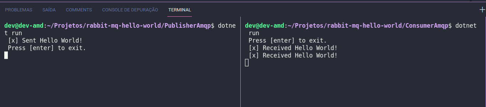

# rabbit-mq-hello-world

Projeto demostra um exemplo extramente simples de utilização do protocolo AMQP através do cliente RabbitMQ. Um servidor é instalado na máquina hospedeira com dois clientes: um do tipo consumidor e o outro do tipo publicador.

## Pré - Requisito

Possuir rodando o RabbitMQ na máquina. Ele pode ser instalado nativamente ou rodar num [container Docker](https://www.rabbitmq.com/download.html).

    docker run -it --rm --name rabbitmq -p 5672:5672 -p 15672:15672 rabbitmq:3-management

## Fonte

[RabbitMQ](https://www.rabbitmq.com/tutorials/tutorial-one-dotnet.html) Criando Consumidor e Publicador Acessado em Junho 2021.
